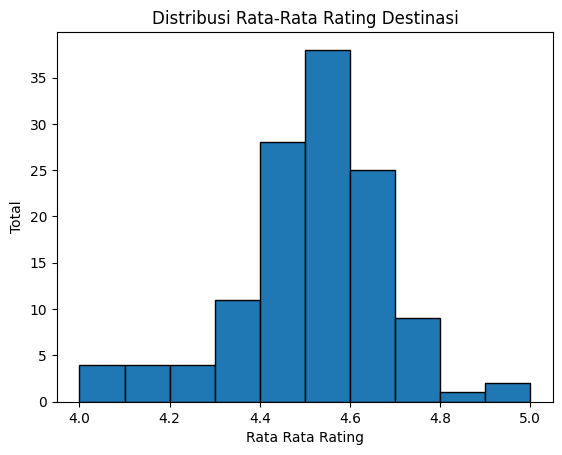
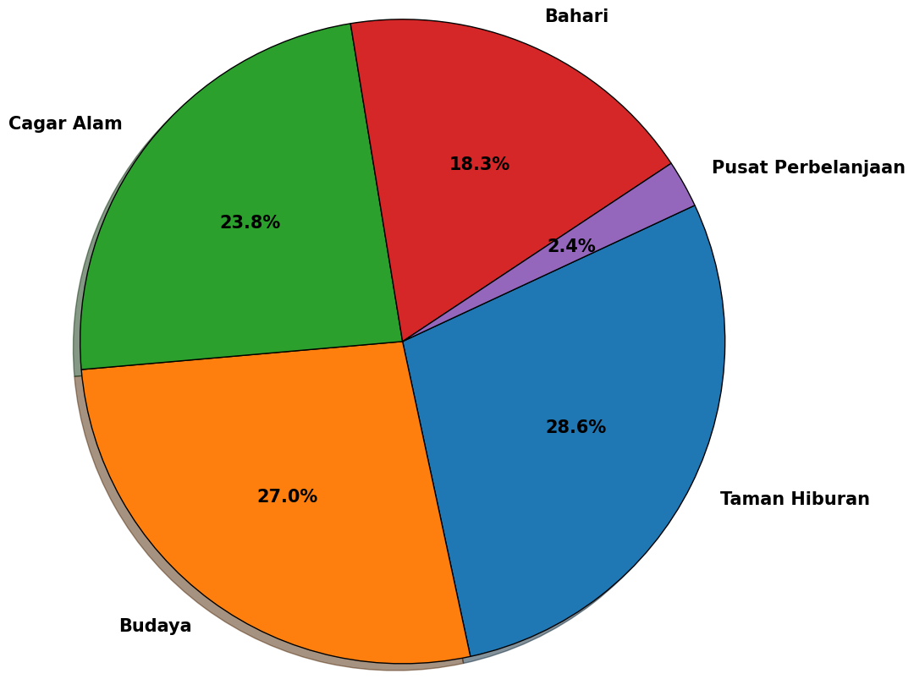
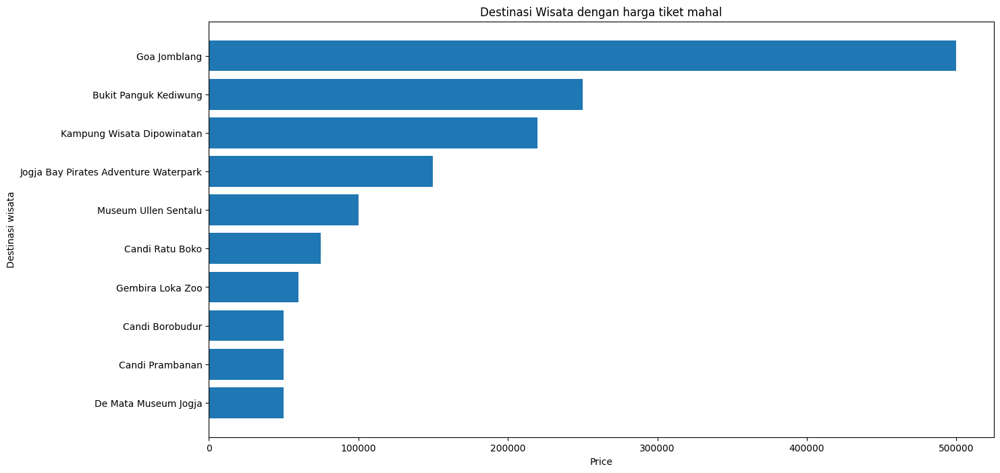
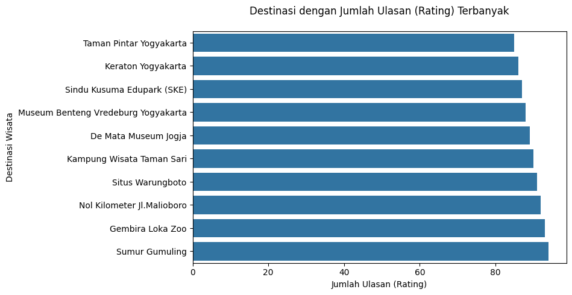
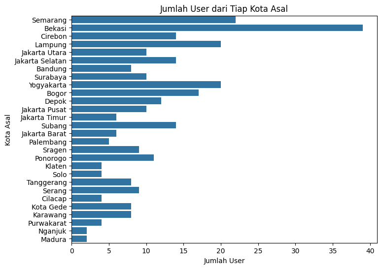

# Laporan Proyek Machine Learning - Haifa Syabina

## Project Overview

Pariwisata merupakan salah satu sektor strategis dalam perekonomian suatu kota. Kota Yogyakarta adalah salah satu tujuan wisata yang menarik para wisatawan karena faktor sejarah dan kebudayaannya. 

Usai COVID 19 melanda, pemerintah berusaha memulihkan perekonomian daerah. Membangun kembali sektor wisata merupakan salah satu usaha pemerintah dalam memulihkan perekonomian daerah yang sempat turun pada saat COVID 19. Namun, dengan banyaknya tujuan wisata yang terdapat di Yogyakarta, hal tersebut menjadi perhatian karena pengunjung akan diberikan banyak informasi tempat wisata. Akan tetapi banyaknya informasi yang masuk terkadang tidak relevan dengan kesukaan pengunjung. Untuk menangani kebutuhan tersebut, sistem rekomendasi menjadisolusi relevan dan efektif untuk masalah ini. 

Dengan menggunakan teknik machine learning dan analisis perilaku pengguna, sistem dapat secara otomatis memberikan saran destinasi wisata berdasarkan preferensi pengguna, riwayat kunjungan, atau bahkan ulasan dari wisatawan lain. Pendekatan ini tidak hanya membantu wisatawan menemukan tempat yang sesuai, tetapi juga dapat meningkatkan penyebaran informasi dan eksposur terhadap destinasi yang kurang populer namun menarik.

Berdasarkan penelitian yang sudah dilakukan tentang sebuah sistem rekomendasi tempat wisata di Kota Semarang dengan
metode collaborative filtering telah terbentuknya sebuah sistem yang dapat mempermudah dan membantu wisatawan berdasarkan pemberian rating dari wisatawan lain. Sistem ini memungkinkan semua orang dapat memberikan rating di dalam sistem
tersebut sehingga memberikan rekomendasi tempat wisata di Kota Semarang. Sistem rekomendasi ini juga dapat mengenalkan
tempat wisata baru di Semarang sehingga diharapkan dapat memunculkan potensi wisata baru di Semarang (Cholil et al., 2023).

Referensi:
- Cholil, S.R dkk. (2023). Sistem Rekomendasi Tempat Wisata di Kota Semarang Menggunakan Metode Collaborative Filtering. JIKO (Jurnal Informatik dan Komputer), 7(1), 118-125. Available at https://media.neliti.com/media/publications/560301-sistem-rekomendasi-tempat-wisata-di-kota-274bc7b9.pdf. 

## Business Understanding

Di tengah maraknya kunjungan wisata dan informasi digital yang melimah, wisatawan mengalami kebingungan menentukan destiansi yang paling sesuai dengan minat mereka. Banyak wisatatan cenderung mengunjungi lokasi yang populer berdasarkan tren atau hasil pencarian pertama. Hal ini dapat menyebabkan ketimpangan wisatawan pada tempat wisata tertentu dan wisata yang tidak sesuai dengan yang diinginkan oleh wisatawan sehingga mengurangi pengalaman wisatawan. Selain itu, dampak tersebut dapat menghambat optimalisasi potensi ekonomi lokal secara meluruh.

### Problem Statements

- Informasi tempat wisata yang kurang relevan dengan preferensi individu
- Kurangnya variasi tujuan wisata
- Tidak merata kunjungan wisatawan yang datang ke wisata tertentu

### Goals

1. Meningkatkan pengalaman pengunjung
   Pengunjung memiliki preferensi yang berbeda-beda. Dengan menyediakan sistem rekomendasi destinasi wisata yang sesuai dengan minat dan kebutuhan secara personal akan meningkatkan pengalaman pengunjung sehingga perjalanan wisata menjadi lebih menyenangkan.
2. Menyebarkan arus kunjungan
   Salah satu tantangan dalam dunia pariwisata adalah konsentrasi kunjungan di lokasi tertentu, sementara destinasi lainnya cenderung sepi. Dengan menyebarkan arus kunjungan wisata maka potensi tempat wisata menjadi merata dan seimbang.
3. Mengoptimalkan promosi destinasi lokal
   Destinasi yang kurang dikenal bisa dimunculkan dalam rekomendasi pengguna dengan preferensi yang cocok. Hal ini lebih efektif dibandingkan promosi umum karena menyasar audiens yang sudah potensial tertarik, sehingga dapat meningkatkan tingkat kunjungan secara organik.
  
Algoritma yang akan digunakan berupa:
- Content-Based Filtering
  Metode ini akan menyarankan destinasi berdasarkan karakteristik yang mirip dengan tempat yang disukai pengunjung
- Collaborative Filtering
  Metode ini digunakan untuk menemukan destinasi baru berdasarkan preferensi pengunjung lain yang serupa sehingga rekomendasi yang akan dihasilkan lebih beragam.

## Data Understanding
Data yang digunakan adalah dataset [Indonesia Tourism Destination](https://www.kaggle.com/datasets/aprabowo/indonesia-tourism-destination/data) yang didapatkan dari Kaggle. Dataset ini berisi 4 file, yaitu tourism_witd_id.csv, user.csv, tourism_rating.csv, dan package_tourism.csv. Namun penulis hanya mengambil 3 dataset teratas yaitu tourism_with_id.csv, user.csv, dan tourism_rating.csv. Selain itu hanya mengambil destinasi pada kota Yogyakarta karena proyek ini terbatas hanya pada satu kota tujuan saja. 
* Dataset: https://www.kaggle.com/datasets/aprabowo/indonesia-tourism-destination/data
### [Tourism Rating](https://www.kaggle.com/datasets/aprabowo/indonesia-tourism-destination?select=tourism_rating.csv)
* Data ini berisi 10000 baris dengan 3 kolom. Berisi rating-rating yang diberikan oleh pengguna dan dibuat untuk sistem rekomendasi berbasis rating.
* Fitur:
  - User_Id : berisi user id untuk tiap pengunjung
  - Place_Id : berisi id tempat untuk tempat yang dikunjungi oleh pengunjung
  - Place_Ratings : berisi penilaian atau rating yang diberikan oleh pengunjung berdasarkan tempat kunjungan mereka.
### [User](https://www.kaggle.com/datasets/aprabowo/indonesia-tourism-destination?select=user.csv)
* Data ini terdapat 300 baris dengan 3 kolom.
* Data ini berisi pengguna dummy untuk membuat fitur rekomendasi berdasarkan user.
* Data ini memiliki 28 lokasi yang berbeda dengan rata-rata usia pengguna adalah 28 tahun.
* Fitur:
  - User_Id : user id untuk tiap pengunjung
  - Location : asal kota tiap pengunjung
  - Age : umur tiap pengunjung
### [Tempat dan Ratingnya](https://www.kaggle.com/datasets/aprabowo/indonesia-tourism-destination?select=tourism_with_id.csv)
* Data ini terdapat kurang lebih 400 baris dengan 12 kolom.
* Berisi informasi tempat wisata yang ada di 5 kota besar di Indonesia, seperti Jakarta, Surabaya, Yogyakarta, Bandung, dan Bali.
* Terdapat 437 destinasi wisata yang tersebar di 5 kota besar beserta rating, deskripsi, kategori, harga tiket masuk, dan lokasi destinasi tersebut.
* Pada fitur time terdapat missing value sebanyak 232.
* Fitur:
  - Place_Id : berisi unik dari Place_Name
  - Place_Name : berisi nama tempat 
  - Desription : berisi deskripsi dari nama tempat
  - Category : berisi kategori dari nama tempat
  - City : berisi kota setiap tempat wisata
  - Price : berisi harga tiket masuk
  - Rating : berisi rating setiap tempat wisata
  - Time_Minutes : tidak diketahui
  - Coordinate : lokasi geografis tempat wisata.
  - Lat : lokasi suatu titik tempat. 

### EDA

Pada grafik tersebut menunjukan distribusi rating pada tiap destinasi. Menunjukkan rating berkisar antara 4-5 dengan 4.5 adalah rating paling banyak diberikan. 

Pada grafik tersebut wisata terbanyak di Yogyakarta adalah taman hiburan dengan persentase sebesar 28.6%. dilanjut kategori budaya sebesar 27%, kategori cagar budaya 23.8%, kategori Bahari 18.3%, dan pusat perbelanjaan sebesar 2.4%. 

Pada grafik tersebut menunjukkan harga tiket termahal di tempat wisata di Yogyakarta. Hasilnya Goa Jomblang adalah wisata dengan harga tiket termahal dengan harga Rp 500.000. 

Pada grafik tersebut menunjukkan bahwa Sumur Gumuling adalah wisata yang banyak diulas oleh pengunjung

Pada grafik tersebut menunjukkan banyaknya pengunjung tiap kota asal. Pengunjung banyak berasal dari Bekasi. Madura dan Nganjuk adalah kota yang paling sedikit pengunjung ke Yogyakarta. 

## Data Preparation
Sebelum melakukan modeling, penulis melakukan preparation pada data yang akan digunakan. 
1. Mengatasi Missing Value
   Pada data destination terdapat missing pada dua fitur. Fitur tersebut akan dihapus dengan menggunakan `.drop()` karena fitur tersebut tidak dibutuhkan dalam pemodelan nanti

### Data Preparation CBF
1. Mengambil destinasi hanya pada daerah Yogyakarta
   `destination[destination['City'] == 'Yogyakarta']`
2. Mengambil data rating pada daerah Yogyakarta
   Menggunanakn fungsi `.merge()` pada data rating dan destination untuk mengambil destinasi pada daerah Yogyakarta
3. Mengambil data user pada userId yang memberi ulasan hanya pada daerah Yogyakarta
   Dengan fungsi `.merge()` kali ini data rating akan digabung dengan data user pada daerah UserId yang memberi rating pada daerah Yogyakarta
  
  
## Data Preparation Collaborative Filtering
1. Melakukan Encoding dan Mapping
   Encoding dan Mapping adalah proses untuk mengubah data object menjadi numerik. Hal ini penting dilakukan untuk mempermudah model mengolah data. Mapping dilakukan untuk menambah data yang di sudah di-encoded kembali ke DataFrame
   Encoding pada User_Id dan Place_Id agar Id memiliki nilai yang sama dimulai dari 0.
3. Membagi data menjadi data uji dan data latih
   Train Test Split adalah proses membagi data menjadi data Train (latih), dan Test (uji), dimana Train untuk latihan model, dan Test untuk uji model.
   Pada proyek ini, penulis mengambil nilai x dari kolom user dan destination dan nilai y dari kolom Place_Ratings.

## Modeling

### Content Based Filtering
1. Melakukan TF-IDF
   TF-IDF adalah metode yang digunakan untuk mengevaluasi seberapa penting suatu kata dalam sebuah dokumen dalam konteks koleksi dokumen yang lebih besar. Metode ini mengukur frekuensi kemunculan kata di dalam sebuah dokumen dan frekuensi di dalam banyak dokumen. Dengan kata lain, TF-IDF membantu menentukan relevansi suatu kata dalam suatu dokumen dibandingkan dengan dokumen-dokumen lainnya.
   Pada kasus ini TF-IDF akan mengubah bentuk data menjadi matriks yang akan digunakan untuk perhitungan cosine similarity menggunanakan fungsi `TfidfVectorizer()`.
3. Menghitung Cosine Similarity
   Cosine Similarity adalah pengukuran yang digunakan untuk mengukur dua vektor dan menentukan apakah kedua vektor tersebut menunjuk ke arah yang sama. Cosine similarity akan menghitung sudut cosinus antara dua vektor. Semakin kecil sudut cosinus, semakin besar nilai cosine similarity. Metrik ini sering digunakan untuk mengukur kesamaan dokumen dalam analisis teks.
   Sebagai contoh, dalam studi kasus ini, cosine similarity digunakan untuk mengukur kesamaan nama tempat dan nama kaetgori.
   Pada tahap ini, Cosine Similarity cukup digunakan dengan memanggil cosine_similarity() pada matriks hasil TF-IDF.
4. Mendapatkan Rekomendasi
   Selanjutnya membuat fungsi rekomendasi dengan nama destination_recommendation(). Parameter yang digunakan adalah:
   - place_name : nama tempat
   - similarity_data: dataframe mengenai similarity yang sudah didefinisikan sebelumnya
   - items: nama dan fitur yang digunakan untuk mendefinisikan kemiripan, dalam hal ini adalah 'Place_Name' dan 'Category'
   - k: banyaknya rekomendasi yang ingin diberikan
5. Sample Retrival
   Contoh rekomendasi
   |Place_Id | Place_Name |	Description	| Category | City | Price | Rating | Coordinate | Lat |	Long |
   |---------|------------|-------------|----------|------|-------|--------|------------|-----|------|
   |198	     |Pantai Greweng|Di Kabupaten Gunungkidul, tidak sulit memilih ...|Bahari|Yogyakarta|5000|4.6|{'lat': -8.197864399999998, 'lng': 110.7186216}|-8.197864|110.718622|
6. Recommendation Result - Top N Recommendations
   Untuk menghasilkan rekomendasi panggil fungsi `destination_recommendation()`
   |  |Place_Name|Category|
   |--|----------|--------|
   |0 |Pantai Congot|Bahari|
   |1 |Pantai Sundak|Bahari|
   |2 |Pantai Depok Jogja|Bahari|
   |3 |Hutan Mangrove Kulon Progo|Bahari|
   |4 |Pantai Sadranan|Bahari|

   Rekomendasi akan menghasilkan kategori yang sama pada destinasi Pantai Greweng.
   

### Collaborative Filtering
1. Membuat kelas RecommenderNet dengan keras Model class.
   RecommenderNet akan menghitung skor kecocokan antar user dan tempat wisata dengan teknik embedding, melakukan operasi dot product, dan menambahkan bias untuk setiap user dan tempat wisata. Selanjutnya akan menghasilkan skala kecocokan dari 0 hingga 1 dengan fungsi Sigmoid.
2. Membuat model dengan memanggil kelas RecommenderNet untuk membuat rekomendasi
3. Melakukan compile pada model dengan menggunakan Binary Crossentropy untuk menghitung loss function Adam (Adaptive Moment Estimation) sebagai optimizer, dan root mean squared error (RMSE) sebagai metrics evaluation.
4. Training: model dilakukan training sebanyak 100 epochs, 8 batch_size, validation_data dengan x_val dan y_val.
5. Sample Retrieval
   Penulis mengambil sample user dan destinasi dengan rating tertinggi dari user tersebut.
   Didapatkan user 129 dan destinasi wisata rating tertinggi dari user adalah Wisata Kraton Jogja dengan kategori Budaya.
7. Prediction Result
   Hasilnya untuk 10 destinasi rekomendasi adalah:
   |Place_Name|Category|
   |----------|--------|
   | Situs Warungboto|Taman Hiburan|
   |Sumur Gumuling|Taman Hiburan|
   |Desa Wisata Sungai Code Jogja Kota|Taman Hiburan|
   |Monumen Yogya Kembali|Budaya|
   |Bukit Bintang Yogyakarta|Taman Hiburan|
   |Monumen Sanapati|Budaya|
   |The World Landmarks - Merapi Park Yogyakarta|Taman Hiburan|
   |Watu Goyang|Budaya|
   |Kampung Wisata Rejowinangun|Budaya|
   |Alun-alun Utara Keraton Yogyakarta|Budaya|

   Hasil tersebut menunjukkan rekomendasi untuk user 129.

* Kelebihan
  - CF : dapat memberikan rekomendasi yang lebih bervariasi. Collaborative filtering dapat memberikan rekomendasi yang bervariasi karena dilihat berdasar pengguna lain namun tetap personal kepada pengguna target.
  - CBF: memberi rekomendasi yang lebih personal dan relevan bagi pengguna. Content based filtering memberikan rekomendasi berdasarkan preferensi unik pengguna target. 

* Kekurangan
  - CF: cold start problem. Collaborative filtering akan mengalami kesulitan ketika ada pengguna baru. Performa metode ini juga akan menurun dengan bertambahnya jumlah pengguna atau item karena perhitungannya akan semakin kompleks.
  - CBF: tidak bisa memberikan rekomendasi yang bervariasi. Karena rekomendasi hanya berdasaran pada preferensi personal saja, maka rekomendasi yang diberikan tidak terlalu bervariasi.

## Evaluation
1. Content Based Filtering
   
   $Precision = \frac{Jumlah  item  relevan  yang  dihasilkan}{Total  item  yang  dihasilkan}$

   Evaluasi untuk Content Based Filtering menggunakan metrik precision. Precision adalah rasio prediksi benar positif dibandingkan dengan keseluruhan hasil yang diprediksi positf
   Setelah dibuat matriks ground_truth yang berisi label sebenarnya dari hasil cosine similarity, dilakukan proses perhitungan evaluasi model dengan metrik precision.
   Matriks cosine similarity dan ground truth dikonversi menjadi array satu dimensi agar mempermudah perbandingan dan perhitungan metrik evaluasi. Hasil prediksi disimpan di predictions.
   Menggunakan fungsi precision_scoreuntuk menghitung nilai precision. Hasilnya nilai precision adalah 1, artinya semua prediksi positif model adalah benar dan tidak terdapat false positive.
   
2. Collaborative Filtering

   $\text{RMSE} = \sqrt{ \frac{1}{n} \sum_{i=1}^{n} (y_i - \hat{y}_i)^2 }$
   
   Evaluasi yang dilakukan untuk model collaborative filtering adalah dengan menggunakan metrik RMSE. RMSE adalah akar kuadrat dari MSE. Secara matematis, RMSE mengukur deviasi standar kesalahan. Mirip dengan MSE, RMSE banyak digunakan dalam regresi dan estimasi model yang memerlukan prediksi numerik.
   Hasilnya, untuk data uji nilai RMSE naik dengan nilai akhir 0.36 sementara untuk data latih nilai RMSE cenderung turun di angka 0.3.

Berdasarkan problem statement yang ada, sistem rekomendasi dengan dua pendekatan tersebut dapat memberikan rekomendasi yang efektif. Dilihat dari evaluasi yang menggunakan metrik precision menghasilkan nilai 1 yang artinya semua prediksi positif model adalah benar dan tidak terdapat false positive. 
Kemudian ketika menggunakan metrik RMSE, nilai RMSE berkisar pada angka 0.3 yang artinya cukup baik dalam memprediksi suatu item. 
Sistem rekomendasi ini akan memberikan informasi kepada pengguna yang ingin melakukan perjalanan wisata dengan destinasi wisata yang sesuai dengan preferensi mereka. 

